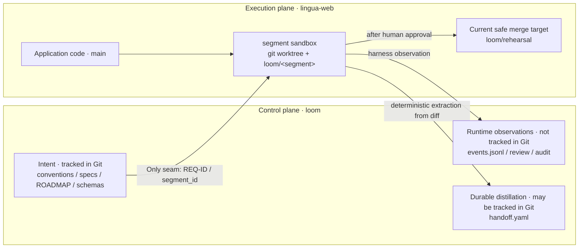

# Loom

[简体中文](README.md) | [日本語](README.ja.md) | English

Loom is a **semi-automated orchestration and execution framework** for software development: humans retain control over product and safety decisions—deciding *what to build* and *whether it may be merged*—while agents perform the labor of writing code, reviewing, testing, and auditing. Its goal is not “fully automated merging.” Its soul is a traceable line joined by stable IDs: **requirement → segment → code → tests → review**, so every artifact and decision can be traced back to the original requirement.

> Current snapshot: this repository implements the P0–P4 skeleton, but it is not yet a production-ready automated development system. Merges currently go only to `loom/rehearsal`; tests are not generated automatically from specs, and review still lacks test-adequacy checks. Read [Known boundaries and unfinished work](#known-boundaries-and-unfinished-work) first. Do not interpret “the skeleton exists” as “the capability has been accepted by a human,” or as permission to bypass human judgment.

## Core mental model

To understand Loom, first understand why it deliberately distrusts anything that merely *looks complete*. [LOOM-BUILD-BRIEF.md](LOOM-BUILD-BRIEF.md) is the source of truth for the design; the code is only one implementation of those constraints at the current stage.

### The seven invariants

| Invariant | Rule in one sentence | Why |
|---|---|---|
| A · ID throughline | Every requirement has a stable `REQ-ID`, reused by the ROADMAP, segments, code, tests, and review. | Without a shared anchor, upstream and downstream artifacts cannot align reliably, and results cannot be traced back to requirements. |
| B · Separate intent from facts | Plans and design rationale go into Git; progress, execution results, and “which interfaces currently exist” are read from code or harness events at the time of use. | Handwritten status goes stale and impersonates reality, eventually making historical documents appear more trustworthy than the real system. |
| C · Harness observation, not agent self-report | Which files changed, which commands ran, and what their exit codes were count only when recorded by the harness. | An agent’s natural-language claims are not verifiable; anti-simulation prevents “I did it” from being accepted as evidence that it actually happened. |
| D · Two independent boundaries | Sandboxes divide file sharing by segment; sessions divide context sharing by role. | Work and test need shared files to proceed continuously, while test, review, and audit must remain cognitively independent. These are different problems. |
| E · Deterministic hard gates | Safety judgments that can block the workflow must be implemented as deterministic code; an LLM may only raise soft warnings and escalate to a human. | Probabilistic judgment cannot be the final safety authority and should not have opaque blocking power. |
| F · Process flows forward only after distillation | Downstream work consumes durable artifacts such as contracts and handoffs, never the raw execution trace of upstream work. | Raw reasoning and process noise contaminate downstream context; what must travel forward is the interface, constraints, and rationale. |
| G · The human merge gate is mandatory | Even when review and audit are green, Loom never merges automatically; the final decision remains human. | Automated checks can reduce labor, but cannot replace product judgment, ownership of risk, or the final interpretation of evidence. |

### Two-plane topology

Loom operates across two Git repositories whose responsibilities must not be mixed:



- **`loom` is the control plane**: it stores intent such as conventions, requirements, and design rationale, and also hosts harness events and run reports; it does not contain the application code being developed.
- **`lingua-web` is the execution plane**: it stores application code; segment branches, worktrees, tests, and merges all happen here.
- **REQ-ID is the only seam**: `segment_id` is always `<REQ-ID>/S<n>`; Loom does not maintain a second cross-repository mapping.
- `events.jsonl` and most of `runs/` are runtime facts and are ignored by Git by default. `handoff.yaml` is a durable distilled artifact consumed downstream and is explicitly allowed into Git by the schema.

See [conventions.md](conventions.md) for the complete definition of the two-plane convention.

### Review and audit are not the same thing

| | Review | Audit |
|---|---|---|
| Core question | “Is the implementation correct and good?” | “Is this change safe, and may it proceed?” |
| Current inputs | Segment acceptance criteria, branch diff relative to `main`, and changed paths observed by the harness | Contract `scope_paths`, file observations from the same run, and the branch diff |
| Current outputs | LLM opinions for each AC plus deterministic presentation of files and scope; the opinions are advisory | Deterministic scope and high-confidence secret scanning; fails closed when observation evidence is missing |
| Workflow authority | May suggest “satisfied / uncertain / unsatisfied,” but does not automatically block a merge by itself | A `blocked` result prevents the merge gate from entering human decision mode |

The target scope of audit in the Brief also includes supply-chain risk, destructive operations, privacy, resource usage, and evidence integrity; **the current implementation provides only the scope and secret hard gates**. Likewise, the current review does not verify that every AC has real test coverage. Humans must interpret each report according to what it actually proves, rather than confusing the target design with the capabilities already implemented.

## Architecture overview: P0–P4

Both the construction and operation of Loom follow phase gates: the existence of code does not mean a phase is complete; completion requires a human to use and accept it personally. P0–P4 have the following responsibilities.

| Phase | Responsibility | Key artifacts and boundaries |
|---|---|---|
| **P0 · Observation foundation** | Define events, append them to JSONL, wrap commands and file observations with the harness, and provide a read-only view. | `events.jsonl`, command/file/test facts, and a static HTML view; keeps P3 from becoming a black box. |
| **P1 · Plan contract and ID throughline** | Humans write the what/why, the how, and a ROADMAP organized by REQ-ID. | `product.md`, `tech.md`, `ROADMAP.md`, and [conventions.md](conventions.md); ROADMAP expresses planning intent, not live progress. |
| **P2 · Segment contract and handoff schema** | Split work into self-contained segments for reviewability, and define how only durable information moves between upstream and downstream work. | `schemas/segment-contract.md`, `schemas/handoff-record.md`, and sequence/HTML previews; execution agents need not read the complete large plan. |
| **P3 · Single-segment execution** | LangGraph orchestrates `orchestrator → work → test`; each segment uses an independent worktree, test uses independent context, and failures enter the `implement → test → fix` loop. | A retained `loom/<segment>` branch, work/test attempt artifacts, and events throughout; the worktree is removed at the end, while the branch remains for P4. |
| **P4 · Review, audit, human merge, and handoff** | Produce review/audit evidence first, then let a human approve or reject; create a `pending` handoff when artifacts are ready and update it to `merged` or `rejected` after the gate decision. | `review.md`, `audit.md`, an interactive merge gate, and `handoff.yaml`; approval currently merges only into `loom/rehearsal`, not the real `main`. |

P5 multi-segment dependency chaining and handoff loading based on `depends_on`, as well as P6 parallelism and enhancements, have not started. Do not assume those capabilities exist.

## Repository structure

```text
loom/
├── src/loom/                 # Framework implementation
├── schemas/                  # Durable segment and handoff contracts
├── specs/                    # Product/technical intent and segments, organized by REQ-ID
├── tests/                    # Loom's own unit tests
├── runs/<run_id>/            # Reports and intermediate artifacts for each run
├── events.jsonl              # Append-only runtime facts; appears after the first run
├── AGENTS.md                 # Standing discipline for agents
├── LOOM-BUILD-BRIEF.md       # Design intent, invariants, and phase roadmap
├── conventions.md            # Human-locked ID and two-plane conventions
└── KNOWN-LIMITS.md           # Known gaps and their historical reasons
```

Each module under `src/loom/` has one responsibility:

- `events.py`: the event schema, actor constraints, and append-only JSONL writer.
- `harness.py`: observes commands, exit codes, duration, and actual file changes.
- `sandbox.py`: creates and prepares execution-plane worktrees, then retains or cleans up segment branches.
- `graph.py`: the single-segment LangGraph and `implement → test → fix` loop; it currently exposes only a Python API and has no working module CLI.
- `review.py`: generates a “hard facts + LLM recommendations” review report for a retained branch.
- `audit.py`: runs deterministic scope/secret hard gates and generates the audit report.
- `merge_gate.py`: verifies review/audit pointers, pauses for a human decision, and performs a rehearsal merge or rejection.
- `handoff.py`: generates or updates a handoff from the contract, Git diff, and merge result; seams are extracted with deterministic AST logic.
- `view.py`: filters events by run/segment and renders them as static HTML.

The Git ownership of runtime artifacts matters:

- `events.jsonl`, `runs/<run_id>/review/`, `audit/`, and raw work/test artifacts are runtime facts and are ignored by Git by default.
- `runs/<run_id>/handoff/handoff.yaml` is an explicit `.gitignore` exception and may be reviewed and committed as a durable control-plane handoff record.

## Quick start

The following steps describe the current repository snapshot. They do not assume an unimplemented CLI or the ability to merge into the real `main`.

### 1. Environment and installation

Requirements:

- Python **3.10+**;
- [uv](https://docs.astral.sh/uv/);
- Git;
- an installed and authenticated `codex` CLI—the work and review nodes invoke it for real;
- a usable `lingua-web` execution repository with a local `main` branch whose project supports `uv sync --extra dev`.

Install Loom in the control plane:

```bash
cd ~/workspace/loom
uv sync
uv run python --version
uv run python -m unittest discover -s tests -v
```

`uv sync` installs Loom itself. Every time an execution sandbox is created, the harness also runs `uv sync --extra dev` inside the fresh worktree. Worktrees do not copy `.venv`, so this step is not an optional optimization.

### 2. Prepare the two planes

The recommended layout places the two long-lived repositories side by side:

```text
~/workspace/loom/         # Control plane
~/workspace/lingua-web/   # Execution plane
```

From the `loom` root, set variables for this run:

```bash
export LOOM_REPO="$PWD"
export EXEC_REPO="$HOME/workspace/lingua-web"
export CONTRACT="$LOOM_REPO/specs/MAT-REQ-001/segments/S1.yaml"
export SEGMENT_ID="MAT-REQ-001/S1"
export BRANCH="loom/MAT-REQ-001-S1"
export EVENTS="$LOOM_REPO/events.jsonl"
export RUN_ID="mat-req-001-s1-$(date -u +%Y%m%dT%H%M%SZ)-$$"

git -C "$EXEC_REPO" status --short
git -C "$EXEC_REPO" branch --list main "$BRANCH"
```

Before starting, confirm that:

- The execution repository working tree can later be switched by the merge gate. Stop and deal with any uncommitted changes first.
- `main` is a local branch, not merely a remote ref.
- `$BRANCH` **does not exist yet**. The branch name is determined solely by `segment_id`, not by `run_id`; a retained branch from the same segment prevents another run.
- `$RUN_ID` has never been used in the same `events.jsonl`, and remains unchanged across graph, review, audit, and gate.

> The real `lingua-web` currently retains the rejected `loom/MAT-REQ-001-S1` branch. Therefore, do not copy these commands and rerun S1 directly in the current environment, and do not silently delete that branch just to run the example. The sequence below is the complete S1 flow on a **real execution plane where the same-named branch does not yet exist**. A human must decide how to handle an old branch.

### 3. Run the graph

There is an entry-point gap that must be acknowledged: `src/loom/graph.py` has no `main()`/`argparse`, so `uv run python -m loom.graph --help` silently exits with status 0 without displaying help or executing a segment. Adding the CLI must be a separate implementation task developed with TDD. Within the README-only scope, the genuinely runnable entry point is `run_segment_graph()`:

```bash
uv run python - <<'PY'
import json
import os

from loom.graph import run_segment_graph

state = run_segment_graph(
    contract_path=os.environ["CONTRACT"],
    run_id=os.environ["RUN_ID"],
    events_path=os.environ["EVENTS"],
    execution_repo_path=os.environ["EXEC_REPO"],
)
summary = {
    "segment_id": state.get("segment_id"),
    "status": state.get("status"),
    "attempts": state.get("attempts"),
    "branch": state.get("sandbox", {}).get("branch_name"),
}
print(json.dumps(summary, ensure_ascii=False, indent=2))
if state.get("status") != "passed":
    raise SystemExit("segment did not pass; stop before review")
PY
```

The graph:

1. Reads the segment, ACs, scope, anti-scope, test selectors, and sequence diagram from the contract.
2. Creates a worktree and the `loom/MAT-REQ-001-S1` branch under `~/.loom/worktrees/MAT-REQ-001-S1`.
3. Prepares dependencies, runs the work session, and then runs the existing pytest files selected by the contract; failures may enter the fix loop up to the configured limit.
4. Lets the harness append commands, exit codes, file changes, and test results to `$EVENTS`.
5. Removes the worktree but commits and retains the branch for P4. A normal completion with `status=failed` also retains it, and review must not continue after failure; if the graph terminates exceptionally without a final state, it cleans up both the worktree and branch.

### 4. Review

```bash
uv run python -m loom.review \
  --contract "$CONTRACT" \
  --run-id "$RUN_ID" \
  --branch "$BRANCH" \
  --events "$EVENTS" \
  --repo "$EXEC_REPO"
```

The command prints the report path, usually `runs/$RUN_ID/review/review.md`. Read both parts:

- Verify that “hard facts” lists the correct harness-observed changed files and scope result.
- Verify that the LLM opinion and rationale for every AC are actually supported by the diff.

Do not infer “the tests are adequate” from “the AC is satisfied”; the current review does not yet establish that evidence chain.

### 5. Audit

```bash
uv run python -m loom.audit \
  --contract "$CONTRACT" \
  --run-id "$RUN_ID" \
  --branch "$BRANCH" \
  --events "$EVENTS" \
  --repo "$EXEC_REPO"
```

The report is usually written to `runs/$RUN_ID/audit/audit.md`. Currently, verify that:

- The scope gate has file observations from the same run and reports no out-of-scope paths.
- The secret gate found no high-confidence credentials in added lines.
- The overall verdict is `passed`. Missing `files_changed` observations produce `blocked`; an empty set is not allowed to pass.

### 6. Human merge gate

Read the reports before starting the interactive gate:

```bash
sed -n '1,240p' "runs/$RUN_ID/review/review.md"
sed -n '1,240p' "runs/$RUN_ID/audit/audit.md"

uv run python -m loom.merge_gate \
  --contract "$CONTRACT" \
  --run-id "$RUN_ID" \
  --branch "$BRANCH" \
  --events "$EVENTS" \
  --repo "$EXEC_REPO"
```

The gate’s actual behavior is:

- If the review pointer is missing, or audit is missing, invalid, or `blocked`, the status is `refused` and the gate never asks for a human decision. **The current CLI still exits 0 when refused**, so inspect the printed `merge gate status` and the events; do not rely on the shell exit code alone.
- When the evidence is complete, the gate first generates a `pending` handoff, then prompts for `approve` or `reject`.
- `approve`: performs a `--no-ff` merge of the source branch into the execution plane’s **`loom/rehearsal`**, records the real merge commit, updates the handoff to `merged`, and then deletes the source branch. It never touches the real `main`.
- `reject`: requires a non-empty human reason, retains the source branch, and updates the handoff to `rejected`; a rejected handoff contains no seams.

Finally, inspect the result:

```bash
sed -n '1,240p' "runs/$RUN_ID/handoff/handoff.yaml"
git status --short -- "runs/$RUN_ID/handoff/handoff.yaml"
git -C "$EXEC_REPO" branch --list "$BRANCH" loom/rehearsal
```

The normal flow does not require running `handoff` separately because the merge gate already generates and updates it. The CLI below is only for **backfilling or rebuilding** the record from a retained branch or an existing reject event; running it early duplicates both the handoff generation and its events:

```bash
uv run python -m loom.handoff \
  --contract "$CONTRACT" \
  --run-id "$RUN_ID" \
  --branch "$BRANCH" \
  --events "$EVENTS" \
  --repo "$EXEC_REPO"
```

### 7. Inspect a run with the P0d view

`view` only reads `events.jsonl` and generates static HTML; it does not modify events:

```bash
uv run python -m loom.view \
  --events "$EVENTS" \
  --run-id "$RUN_ID" \
  --segment-id "$SEGMENT_ID" \
  --output "events-$RUN_ID-view.html"
```

Open `events-$RUN_ID-view.html` in a browser. The view neither opens a browser automatically nor prints the output path. When a judgment is disputed, return to the relevant `command_run`, `files_changed`, or review/audit/handoff pointer instead of citing the agent’s prose summary.

The main artifacts from one run are:

| Location | Meaning | Git ownership |
|---|---|---|
| `events.jsonl` | Append-only events written by Loom/the harness and labeled by actor; the throughline for runtime facts | Ignored |
| `runs/<run_id>/<segment>/work-attempt-*` | Work prompts, structured output, and command evidence | Ignored |
| `runs/<run_id>/<segment>/test-attempt-*` | pytest stdout/stderr and attempt evidence | Ignored |
| `runs/<run_id>/review/review.md` | Hard-fact presentation + LLM review recommendations | Ignored |
| `runs/<run_id>/audit/audit.md` | Current scope/secret hard-gate report | Ignored |
| `runs/<run_id>/handoff/handoff.yaml` | Durable handoff record consumable by downstream work | May be tracked in Git |

## Key workflow conventions

### Writing a segment contract

Follow the [segment contract schema](schemas/segment-contract.md). A contract must be self-contained so that an execution agent can work without reading the entire global plan:

- `segment_id`: `<REQ-ID>/S<n>`, for example `MAT-REQ-001/S1`; the anchor for the ID throughline.
- `covers_req`: one REQ-ID; a segment serves exactly one requirement.
- `title`: a human-readable name in one sentence.
- `acceptance`: each criterion uses `<segment_id>/AC<n>` and must translate into a clear pass/fail test; it is both the source for test derivation and the target for review.
- `anti_scope`: `defer` means a later segment will implement it, so a semantic match is an early-work warning and flows into the handoff; `out_of_req` means the entire requirement excludes it, so a match should block by design. Current review/audit does not yet implement content-level anti-scope checks. Do not misread this design rule as an existing automated check.
- `depends_on`: the list of upstream segments; it determines execution order and, in future P5, which handoffs may be loaded.
- `scope_paths`: the execution-plane paths that may be modified, serving as the anchor for the deterministic out-of-scope gate. Verify the real repository structure before writing the contract.
- `test_selectors`: **existing pytest files** chosen by a human; required, but may be `[]`. Test files must be outside `scope_paths` so the work agent cannot change tests to accommodate its implementation. The current test node does not generate new tests.
- `preview`: every segment needs a sequence diagram; segments with user-visible UI also require an HTML preview. It is both a preview and a future target for P4 drift detection.

The upstream intent for the pilot [MAT-REQ-001/S1](specs/MAT-REQ-001/segments/S1.yaml) lives in [product.md](specs/MAT-REQ-001/product.md), [tech.md](specs/MAT-REQ-001/tech.md), and [ROADMAP.md](specs/MAT-REQ-001/ROADMAP.md). The requirement addresses incorrect source tags permanently contaminating materials and `/knowledge` filter results. Humans have locked the decisions to remove only the association—not the tag itself—using hard deletion, a full-page refresh, and confirmation, without batch removal or undo.

### Reading a handoff

The [handoff schema](schemas/handoff-record.md) assigns confidence according to the cost of being wrong:

| Confidence | Fields | Source and interpretation |
|---|---|---|
| Hard facts | `seams`, `covers_req`, `pointers` | Obtained deterministically by the harness from the contract, Git/diff, and runtime artifacts; an LLM may not fill them freely. |
| Mechanical transfer | `covers_req`, entries in `deferred` with `origin: contract` | Copied verbatim from the upstream contract without adding a new judgment. |
| Soft information | `key_decisions`, entries in `deferred` with `origin: discovered` | LLM-distilled and advisory; may be empty and cannot serve as hard-gate evidence. The current implementation does not yet generate either category of soft information. |

`seams` are the public interfaces that downstream work actually integrates with, not the agent’s “implementation notes.” The current extractor supports only Python/FastAPI/SQLAlchemy and deliberately follows a conservative **prefer omissions over false positives** policy:

- Routes: added or changed FastAPI method + router prefix/path.
- Functions: added module-level functions, or module-level functions whose signatures changed, excluding private names beginning with `_`.
- Database: structural changes to SQLAlchemy tables/columns.
- Logic inside a function body that does not create a module-level interface is not a seam, and Loom **never infers a DB seam from application DML**.

Lifecycle:

- `pending`: artifacts are ready and the main body has been extracted from the branch diff relative to `main`, but the human decision has not happened; `pointers.merge_commit` is empty.
- `merged`: updated after human approval and must include the actual merge commit.
- `rejected`: retains `covers_req`, the human `reject_reason`, and `deferred`; it neither extracts nor retains seams, so downstream work cannot depend on an interface that was never merged.

### Runtime conventions that must not be broken

- A `run_id` is globally single-use within one `events.jsonl`; a repeated graph start is rejected deterministically.
- Graph, review, audit, merge gate, and handoff must use the same `run_id` and `segment_id`, or their evidence cannot be joined.
- A segment branch name is derived only from `segment_id`; a new `run_id` does not bypass an old retained branch.
- Agents must never handwrite, rewrite, or fabricate runtime events. Events must come from the harness/orchestration observation path.
- Plans, design rationale, schemas, and durable handoffs belong to the Git-tracked intent side. Events, progress, command output, and run reports belong to the observation side and are ignored by Git by default.
- Facts must be evaluated on the correct plane: application diffs, branches, and tests live in `lingua-web`; events, contracts, reports, and handoffs live in `loom`.
- LangGraph checkpoints serve only graph recovery/interrupt and are not a source of truth for progress; progress must be derived by querying events.

## For future agents

### Safe takeover order

1. Read [AGENTS.md](AGENTS.md) and [LOOM-BUILD-BRIEF.md](LOOM-BUILD-BRIEF.md) completely first. The seven invariants are not implementation details that can be locally optimized away.
2. Then read [conventions.md](conventions.md), both [schemas](schemas/), and [KNOWN-LIMITS.md](KNOWN-LIMITS.md) to distinguish human-decided interfaces from capabilities that are not yet implemented.
3. For the task at hand, read the corresponding `specs/<REQ-ID>/product.md`, `tech.md`, `ROADMAP.md`, and segment YAML. Do not infer the “why” from code alone.
4. Only then read the relevant `src/loom/` and tests to verify “what the system currently does.” Do not let the current implementation rewrite the design intent retroactively.

When continuing development: work on only one authorized task at a time; do not advance to the next phase until a human has accepted the current one; do not independently change REQ-ID rules, segment/handoff fields, or any of the seven invariants. Code changes must derive tests from the spec, confirm red first, leave a checkpoint, and then implement until green; never change tests to accommodate an implementation. Every “passed” or “complete” claim must include real command output, exit code, and diff—agent self-report is not evidence. Deletion, migrations, schemas, credentials, network egress, and new dependencies are high-cost operations; stop and let a human decide first.

### Known boundaries and unfinished work

See [KNOWN-LIMITS.md](KNOWN-LIMITS.md) for the complete history and rationale. At minimum, remember:

- **The graph module CLI is missing**: `python -m loom.graph` is currently a silent no-op and the graph can run only through the Python API. Adding the CLI is a separate task; a README cannot pretend it exists.
- **The test chain is incomplete**: test runs only the existing tests selected by the contract and does not generate new tests from acceptance criteria; `succeeded/passed` does not imply functional correctness.
- **Review evidence is insufficient**: there is no per-AC test-adequacy check, and review has not yet been validated against a known-bad implementation; an LLM opinion must not automatically block or approve.
- **Audit is only the current subset**: the implementation provides deterministic scope and secret gates; the other safety categories in the Brief remain targets, not delivered facts.
- **Merging is still a rehearsal**: approval goes only to `loom/rehearsal`, never to `lingua-web/main`. Humans will decide when to switch to the real main after trust in the reports has been established.
- **As-built is not yet closed-loop**: the schema includes `pointers.as_built_diagram`, but the current flow does not generate the reverse diagram, so this handoff pointer remains empty.
- **Seam extraction is bound to the current stack**: it understands only Python/FastAPI/SQLAlchemy. Supporting another stack requires rewriting the extraction rules; an LLM must not fill the gap with fuzzy inference.
- **Event storage is not concurrency-ready**: the writer has no file lock and all runs share one JSONL. Evidence for multiple runs must be filtered by both `run_id + segment_id`; serialization or partitioning must be solved before P5 parallelism.
- **Failure classification is coarse**: Loom currently records exit codes and duration, but cannot reliably distinguish timeouts, command misconfiguration, and implementation errors; the fix loop may retry blindly.
- **The execution environment has real prerequisites**: scope paths must match the real execution repository; fresh worktrees depend on `uv sync --extra dev`; real artifacts must be verified on the real execution plane—a temporary repository cannot prove persistent branch/merge behavior.
- **P5/P6 are not implemented**: do not assume multi-segment handoff loading, parallel execution, or cumulative regression already exists.

### Current historical state: MAT-REQ-001/S1 was rejected

The P0–P4 skeleton has been implemented through the handoff lifecycle, but the first real S1 merge decision demonstrated that “green does not mean trustworthy.” Review marked all four ACs as satisfied and audit `passed`, yet all 59 tests were pre-existing add/tagging tests and none covered the new remove behavior; the work agent’s self-report was also unreliable. The human therefore rejected it with the reason: “The removal feature has no test coverage; the work self-report is unreliable.”

This history is durably recorded in [KNOWN-LIMITS.md](KNOWN-LIMITS.md) and the [rejected handoff](runs/p4-0-real-verify-001/handoff/handoff.yaml). The latter has no seams and retains only `covers_req`, the human rejection reason, and contract-deferred items, exactly as required by the handoff schema for a rejected artifact. This case is not a blemish to hide as a system failure; it is direct evidence for preserving Loom’s human merge gate and anti-simulation principle.

---

For design questions, [LOOM-BUILD-BRIEF.md](LOOM-BUILD-BRIEF.md) is authoritative. For operating discipline, follow [AGENTS.md](AGENTS.md). For current implementation boundaries, consult [KNOWN-LIMITS.md](KNOWN-LIMITS.md) and real harness events. When those three do not cover a choice, propose one concrete option and ask the human one question at a time; do not invent a definition independently.
