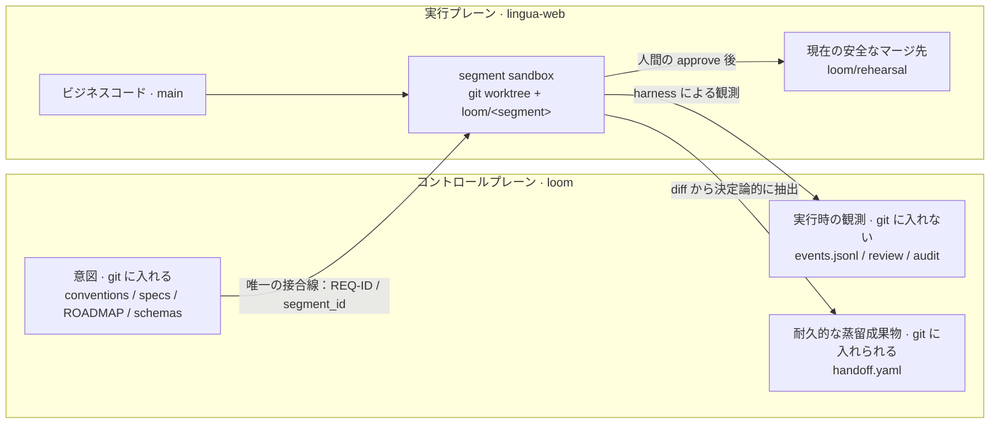

# Loom

[简体中文](README.md) | 日本語 | [English](README.en.md)

Loom は、ソフトウェア開発のための**半自動オーケストレーション＋実行フレームワーク**です。人間がプロダクトと安全性に関する判断を担い、「何を作るか」「マージしてよいか」を決め、エージェントがコード作成、review、テスト、audit などの作業を担います。目標は「全自動 merge」ではありません。その本質は、安定した ID で結ばれた追跡可能な一本の主線、すなわち**要件 → segment → コード → テスト → review**です。これにより、すべての成果物と判断を元の要件までさかのぼれます。

> 現在のスナップショット：このリポジトリには P0–P4 の骨格が実装されていますが、まだ本番運用可能な自動開発システムではありません。現在のマージ先は `loom/rehearsal` に限られ、spec からテストを自動生成せず、review にもテストの十分性チェックがありません。まず[既知の境界と未完了項目](#既知の境界と未完了項目)を読み、「骨格が存在する」ことを「人間の受け入れを完了した」または「人間の判断を省略できる」と解釈しないでください。

## 中核となるメンタルモデル

Loom を理解するには、まず「完了したように見える」状態を、なぜ意図的に信用しないのかを理解してください。設計上の根拠は [LOOM-BUILD-BRIEF.md](LOOM-BUILD-BRIEF.md) が正であり、コードは現段階におけるこれらの制約の一実装にすぎません。

### 7 つの不変条件

| 不変条件 | 一文で表したルール | 理由 |
|---|---|---|
| A · ID の主線 | 各要件には安定した `REQ-ID` を使い、ROADMAP、segment、コード、テスト、review のすべてで継承する。 | 共通のアンカーがなければ、上流と下流を確実に対応づけられず、結果から要件へ追跡することもできないため。 |
| B · 意図と事実の分離 | 計画と設計理由は git に入れ、進捗、実行結果、「現在どのインターフェースがあるか」はコードまたは harness のイベントからその都度読み取る。 | 手書きの状態は古くなって現実を装い、最終的に履歴文書のほうが実システムより信頼される事態を招くため。 |
| C · エージェントの自己申告ではなく harness による観測 | 変更ファイル、実行コマンド、exit code は、harness が記録した証拠だけを認める。 | エージェントの自然言語による宣言は検証できないため。anti-simulation は、「実行したと言った」ことが「実際に実行した」こととして扱われるのを防ぐ。 |
| D · 2 つの独立した境界 | sandbox は segment ごとにファイル共有を分離し、session はロールごとにコンテキスト共有を分離する。 | work/test は継続作業のためにファイルを共有する必要がある一方、test/review/audit は認知的に独立していなければならず、両者は同じ問題ではないため。 |
| E · 決定論的なハードゲート | フローを阻止できる安全判断は、決定論的コードが行う。LLM はソフトな警告を出し、人間へエスカレーションするだけにする。 | 確率的判断は最終的な安全上の権威にはなれず、説明不能な阻止権を持つべきでもないため。 |
| F · プロセスは蒸留後にのみ下流へ流す | 下流は契約や handoff などの耐久成果物だけを参照し、上流の生の実行 trace は読まない。 | 生の思考やプロセスのノイズは下流のコンテキストを汚染するため。本当に引き継ぐべきものは、インターフェース、制約、理由である。 |
| G · 人間によるマージゲートは省略不可 | review と audit がともにグリーンでも自動 merge せず、最終判断は人間が行う。 | 自動チェックは作業量を減らせても、プロダクト判断、リスク責任、証拠の最終解釈を代替できないため。 |

### 2 プレーン構成

Loom は 2 つの Git リポジトリにまたがって動作し、両者の責務を混同してはいけません。



- **`loom` はコントロールプレーン**です。規約、要件、設計理由などの意図を保存するとともに、harness のイベントと実行レポートを保持します。開発対象のビジネスコードは置きません。
- **`lingua-web` は実行プレーン**です。ビジネスコードを保存し、segment branch、worktree、テスト、マージはここで行います。
- **唯一の接合線は REQ-ID** です。`segment_id` は `<REQ-ID>/S<n>` に固定し、リポジトリ間を結ぶ第 2 のマッピングは管理しません。
- `events.jsonl` と `runs/` の大部分は実行事実であり、デフォルトでは git に無視されます。`handoff.yaml` は下流が参照する耐久的な蒸留成果物であり、schema 上の例外として git に含められます。

2 プレーン規約の完全な定義は [conventions.md](conventions.md) を参照してください。

### Review と audit は別物

| | Review | Audit |
|---|---|---|
| 中心となる問い | 「実装は正しいか、品質はよいか？」 | 「今回の変更は安全か、通過を許可できるか？」 |
| 現在の入力 | segment の受け入れ基準、`main` に対する branch diff、harness が観測した変更パス | 契約の `scope_paths`、同じ run における harness のファイル観測、branch diff |
| 現在の出力 | AC ごとの LLM の見解、および決定論的なファイル/scope 表示。見解は人間の参考情報 | 決定論的な scope と高確度 secret のスキャン。観測証拠がない場合は fail closed |
| フロー上の権限 | 「満たす / 疑わしい / 満たさない」を提案できるが、それ自体では merge を自動的に阻止しない | `blocked` になると merge gate は人間の判断へ進むことを拒否する |

Brief における audit の目標範囲には、サプライチェーン、破壊的操作、プライバシー、リソース、証拠の完全性も含まれます。**現在のコードで実装済みのハードゲートは scope と secret の 2 種類だけです**。同様に、現在の review は「各 AC に実際のテストカバレッジがあるか」をまだ確認しません。レポートが証明している範囲に従ってレポートを解釈し、目標設計を現在の能力と取り違えないでください。

## アーキテクチャ概要：P0–P4

Loom の構築と利用は、どちらもフェーズゲートに従います。コードが存在してもフェーズ完了ではなく、人間が実際に使って承認して初めて完了です。P0–P4 の責務は次のとおりです。

| フェーズ | 責務 | 主な成果物と境界 |
|---|---|---|
| **P0 · 観測基盤** | イベントを定義し、JSONL へ追記し、harness でコマンドとファイルの観測を包み、読み取り専用ビューを提供する。 | `events.jsonl`、コマンド/ファイル/test の事実、静的 HTML ビュー。P3 をブラックボックスにしない。 |
| **P1 · Plan 契約と ID の主線** | 人間が what/why、how、および REQ-ID 単位に編成した ROADMAP を記述する。 | `product.md`、`tech.md`、`ROADMAP.md`、[conventions.md](conventions.md)。ROADMAP は計画上の意図であり、リアルタイムの進捗は記録しない。 |
| **P2 · Segment 契約と handoff schema** | 「レビュー可能性」に基づいて自己完結した segment に分割し、上流と下流が耐久情報だけを渡す方法を定める。 | `schemas/segment-contract.md`、`schemas/handoff-record.md`、sequence/html preview。実行エージェントは大きな plan 全体を読む必要がない。 |
| **P3 · 単一 segment の実行** | LangGraph が `orchestrator → work → test` を編成し、segment ごとに独立した worktree を使う。test は独立したコンテキストを使い、失敗時は `implement → test → fix` ループに進む。 | `loom/<segment>` retained branch、work/test の試行成果物、全行程の events。worktree は終了後に削除し、branch は P4 用に保持する。 |
| **P4 · Review、audit、人間によるマージ、handoff** | まず review/audit の証拠を生成し、その後に人間が approve/reject を判断する。成果物の準備完了時に `pending` handoff を生成し、ゲート結果に応じて `merged` または `rejected` に更新する。 | `review.md`、`audit.md`、対話式 merge gate、`handoff.yaml`。現在の approve は `loom/rehearsal` にのみマージし、実際の `main` には入れない。 |

P5 の複数 segment 依存連携、`depends_on` に基づく handoff のロード、および P6 の並列化・拡張機能は未着手です。それらが存在すると先回りして仮定しないでください。

## ディレクトリ構成

```text
loom/
├── src/loom/                 # フレームワーク実装
├── schemas/                  # segment と handoff の耐久契約
├── specs/                    # REQ-ID ごとのプロダクト/技術上の意図と segment
├── tests/                    # Loom 自体のユニットテスト
├── runs/<run_id>/            # 各 run のレポートと中間成果物
├── events.jsonl              # append-only の実行事実。初回実行後に作成
├── AGENTS.md                 # エージェントの常設規律
├── LOOM-BUILD-BRIEF.md       # 設計意図、不変条件、フェーズロードマップ
├── conventions.md            # 人間が確定した ID と 2 プレーン規約
└── KNOWN-LIMITS.md           # 既知の不足とその歴史的理由
```

`src/loom/` の各モジュールは、1 種類の責務だけを担います。

- `events.py`：イベント schema、actor 制約、append-only JSONL writer。
- `harness.py`：コマンド、exit code、所要時間、実際のファイル変更を観測。
- `sandbox.py`：実行プレーンで worktree を作成/準備し、segment branch を保持または削除。
- `graph.py`：単一 segment の LangGraph と `implement → test → fix` ループ。現在は Python API だけを提供し、動作する module CLI はない。
- `review.py`：retained branch から「ハードな事実 + LLM の提案」で構成される review レポートを生成。
- `audit.py`：決定論的な scope/secret ハードゲートを実行し、audit レポートを生成。
- `merge_gate.py`：review/audit のポインターを照合し、人間の判断を待って、rehearsal merge または reject を実行。
- `handoff.py`：契約、git diff、merge 結果から handoff を生成/更新。seams は決定論的な AST 抽出を使用。
- `view.py`：イベントを run/segment でフィルターし、静的 HTML にレンダリング。

実行成果物の Git 上の帰属は重要です。

- `events.jsonl`、`runs/<run_id>/review/`、`audit/`、work/test の生の成果物は実行事実であり、デフォルトでは git に入れません。
- `runs/<run_id>/handoff/handoff.yaml` は `.gitignore` の明示的な例外であり、意図側の耐久引き継ぎ記録として review 後にコミットできます。

## クイックスタート

以下の手順は現在のリポジトリスナップショットを対象とし、未実装の CLI や実際の `main` へのマージ機能があるとは仮定しません。

### 1. 環境とインストール

必要なもの：

- Python **3.10+**
- [uv](https://docs.astral.sh/uv/)
- Git
- インストール済みでログイン済みの `codex` CLI。work と review ノードは実際にこれを呼び出します。
- 利用可能な `lingua-web` 実行リポジトリ。ローカルに `main` が存在し、プロジェクトが `uv sync --extra dev` に対応していること。

コントロールプレーンに Loom をインストールします。

```bash
cd ~/workspace/loom
uv sync
uv run python --version
uv run python -m unittest discover -s tests -v
```

`uv sync` は Loom 自体をインストールします。execution sandbox の作成時には毎回、harness が fresh worktree 内でさらに `uv sync --extra dev` を実行します。worktree は `.venv` をコピーしないため、この手順は省略可能な最適化ではありません。

### 2. 2 つのプレーンを準備する

2 つの長期運用リポジトリを並べて配置することを推奨します。

```text
~/workspace/loom/         # コントロールプレーン
~/workspace/lingua-web/   # 実行プレーン
```

`loom` のルートディレクトリで、今回の実行変数を設定します。

```bash
export LOOM_REPO="$PWD"
export EXEC_REPO="$HOME/workspace/lingua-web"
export CONTRACT="$LOOM_REPO/specs/MAT-REQ-001/segments/S1.yaml"
export SEGMENT_ID="MAT-REQ-001/S1"
export BRANCH="loom/MAT-REQ-001-S1"
export EVENTS="$LOOM_REPO/events.jsonl"
export RUN_ID="mat-req-001-s1-$(date -u +%Y%m%dT%H%M%SZ)-$$"

git -C "$EXEC_REPO" status --short
git -C "$EXEC_REPO" branch --list main "$BRANCH"
```

開始前に確認してください。

- 後で merge gate が branch を切り替えられるよう、実行リポジトリのワークツリーをその状態にしておくこと。未コミットの変更がある場合は停止して対処してください。
- `main` が remote ref だけでなく、ローカル branch として存在すること。
- `$BRANCH` が**まだ存在しない**こと。branch 名は `segment_id` だけから決まり、`run_id` には依存しません。同じ segment の retained branch があると再実行できません。
- 同じ `events.jsonl` で `$RUN_ID` を過去に一度も使っておらず、graph、review、audit、gate の全行程で同じ値を維持すること。

> 現在の実際の `lingua-web` には、reject された `loom/MAT-REQ-001-S1` が保持されています。そのため、現在の現場でコマンドをそのままコピーして S1 を再実行したり、例を動かすためにそれを暗黙的に削除したりしないでください。以下は、**同名 branch がまだ存在しない実際の実行プレーン**における S1 の完全な手順です。古い branch をどう扱うかは、人間が判断しなければなりません。

### 3. graph を実行する

現在、直視すべきエントリーポイント上の不足があります。`src/loom/graph.py` には `main()`/`argparse` がないため、`uv run python -m loom.graph --help` は何も表示せず、segment も実行しないまま 0 で終了します。CLI の追加は独立した実装タスクとして TDD で進めるべきです。README-only の範囲で実際に動作するエントリーポイントは `run_segment_graph()` です。

```bash
uv run python - <<'PY'
import json
import os

from loom.graph import run_segment_graph

state = run_segment_graph(
    contract_path=os.environ["CONTRACT"],
    run_id=os.environ["RUN_ID"],
    events_path=os.environ["EVENTS"],
    execution_repo_path=os.environ["EXEC_REPO"],
)
summary = {
    "segment_id": state.get("segment_id"),
    "status": state.get("status"),
    "attempts": state.get("attempts"),
    "branch": state.get("sandbox", {}).get("branch_name"),
}
print(json.dumps(summary, ensure_ascii=False, indent=2))
if state.get("status") != "passed":
    raise SystemExit("segment did not pass; stop before review")
PY
```

graph は次を行います。

1. 契約から segment、AC、scope、anti-scope、test selectors、sequence diagram を読み取る。
2. `~/.loom/worktrees/MAT-REQ-001-S1` に worktree と `loom/MAT-REQ-001-S1` branch を作成する。
3. 依存関係を準備し、work session を実行してから、契約に指定された既存の pytest ファイルを実行する。失敗時は規定回数まで fix ループに入る。
4. harness がコマンド、exit code、ファイル変更、テスト結果を `$EVENTS` に追記する。
5. worktree を削除するが、コミット済み branch は P4 用に保持する。正常終了で `status=failed` の場合も保持するため、失敗時は review へ進まないこと。graph が例外によって最終状態を得られない場合は、worktree と branch を削除する。

### 4. Review

```bash
uv run python -m loom.review \
  --contract "$CONTRACT" \
  --run-id "$RUN_ID" \
  --branch "$BRANCH" \
  --events "$EVENTS" \
  --repo "$EXEC_REPO"
```

コマンドはレポートのパスを出力します。通常は `runs/$RUN_ID/review/review.md` です。次の 2 点を確認してください。

- 「ハードな事実」に、harness-observed changed files と scope 結果が正しく列挙されているか。
- 各 AC に対する LLM の見解と理由が、本当に diff に裏付けられているか。

「AC を満たす」から「テストが十分である」と推論しないでください。現在の review は、この証拠連鎖をまだ構築していません。

### 5. Audit

```bash
uv run python -m loom.audit \
  --contract "$CONTRACT" \
  --run-id "$RUN_ID" \
  --branch "$BRANCH" \
  --events "$EVENTS" \
  --repo "$EXEC_REPO"
```

レポートは通常 `runs/$RUN_ID/audit/audit.md` にあります。現在は次を確認します。

- scope gate に同じ run のファイル観測があり、範囲外のパスが現れていないか。
- secret gate が追加行の高確度 credential を検出していないか。
- overall verdict が `passed` か。`files_changed` の観測がない場合、空集合として通過するのではなく `blocked` と見なされる。

### 6. 人間によるマージゲート

レポートを読んでから、対話式 gate を開始します。

```bash
sed -n '1,240p' "runs/$RUN_ID/review/review.md"
sed -n '1,240p' "runs/$RUN_ID/audit/audit.md"

uv run python -m loom.merge_gate \
  --contract "$CONTRACT" \
  --run-id "$RUN_ID" \
  --branch "$BRANCH" \
  --events "$EVENTS" \
  --repo "$EXEC_REPO"
```

gate の実際の動作：

- review pointer がない場合、または audit が欠落/無効/`blocked` の場合、状態は `refused` となり、人間の判断を求めません。**現在の CLI は refused でも exit 0 を返します**。shell の exit code だけで判断せず、表示される `merge gate status` と events を確認してください。
- 証拠がそろっている場合、まず `pending` handoff を生成し、次に `approve` または `reject` の入力を求めます。
- `approve`：source branch を `--no-ff` で実行プレーンの **`loom/rehearsal`** にマージし、実際の merge commit を記録し、handoff を `merged` に更新してから source branch を削除します。実際の `main` には触れません。
- `reject`：空でない人間の理由を要求し、source branch を保持して、handoff を `rejected` に更新します。rejected handoff に seams は含まれません。

最後に確認します。

```bash
sed -n '1,240p' "runs/$RUN_ID/handoff/handoff.yaml"
git status --short -- "runs/$RUN_ID/handoff/handoff.yaml"
git -C "$EXEC_REPO" branch --list "$BRANCH" loom/rehearsal
```

通常のフローで `handoff` を単独実行する必要はありません。merge gate が生成と更新をすでに担っています。次の CLI は、retained branch または既存の reject event を基に記録を**バックフィル/再構築**する場合だけに使います。先に実行すると、記録とイベントが重複して生成されます。

```bash
uv run python -m loom.handoff \
  --contract "$CONTRACT" \
  --run-id "$RUN_ID" \
  --branch "$BRANCH" \
  --events "$EVENTS" \
  --repo "$EXEC_REPO"
```

### 7. P0d ビューで run を確認する

`view` は `events.jsonl` を読み取って静的 HTML を生成するだけで、イベントを変更しません。

```bash
uv run python -m loom.view \
  --events "$EVENTS" \
  --run-id "$RUN_ID" \
  --segment-id "$SEGMENT_ID" \
  --output "events-$RUN_ID-view.html"
```

その後、ブラウザーで `events-$RUN_ID-view.html` を開きます。view はブラウザーを自動で開かず、output のパスも表示しません。判断に異論がある場合は、エージェントの文章による要約ではなく、対応する `command_run`、`files_changed`、review/audit/handoff pointer に戻って確認してください。

1 回の run における主な成果物は次のとおりです。

| 場所 | 意味 | Git 上の帰属 |
|---|---|---|
| `events.jsonl` | Loom/harness が書き込み、actor ごとに印づけされた append-only イベント。実行事実の主線 | 無視 |
| `runs/<run_id>/<segment>/work-attempt-*` | work prompt、構造化出力、コマンド証拠 | 無視 |
| `runs/<run_id>/<segment>/test-attempt-*` | pytest stdout/stderr と試行証拠 | 無視 |
| `runs/<run_id>/review/review.md` | ハードな事実の表示 + LLM review の提案 | 無視 |
| `runs/<run_id>/audit/audit.md` | 現在の scope/secret ハードゲートレポート | 無視 |
| `runs/<run_id>/handoff/handoff.yaml` | 下流が参照できる耐久引き継ぎ記録 | git に含められる |

## 主要なワークフロー規約

### Segment 契約の書き方

[segment contract schema](schemas/segment-contract.md) を正とします。契約は自己完結していなければならず、実行エージェントは global plan 全体を読まなくても作業できる必要があります。

- `segment_id`：`<REQ-ID>/S<n>`。例：`MAT-REQ-001/S1`。ID の主線のアンカーです。
- `covers_req`：単一の REQ-ID。1 つの segment は 1 つの要件だけを対象とします。
- `title`：人間が読める 1 文の名称。
- `acceptance`：各項目に `<segment_id>/AC<n>` を使い、明確な pass/fail テストへ変換できなければなりません。test の派生元であり、review の対象でもあります。
- `anti_scope`：`defer` は後続 segment で実施することを示し、意味上、該当する変更は先走りとして警告され、handoff に流れます。`out_of_req` は要件全体で実施しないことを示し、設計上、該当する変更は阻止されるべきです。現在の review/audit は内容レベルの anti-scope 判定をまだ実装していないため、この設計ルールを実装済みの自動チェックと誤解しないでください。
- `depends_on`：上流 segment のリスト。実行順を決めるだけでなく、将来 P5 がどの handoff だけをロードするかも決めます。
- `scope_paths`：変更が許可される実行プレーン上のパス。決定論的な範囲外ゲートのアンカーであり、契約を書く前に実際の repo 構成と照合しなければなりません。
- `test_selectors`：人間が指定する**既存の pytest ファイル**。必須ですが `[]` でも構いません。work エージェントが実装に合わせてテストを変更することを防ぐため、テストファイルは `scope_paths` の外になければなりません。現在の test ノードは新しいテストを生成しません。
- `preview`：すべての segment に sequence diagram が必要です。ユーザーに見える UI がある場合は HTML preview も必要です。preview であるだけでなく、P4 のドリフト検出対象にもなるべきものです。

パイロット [MAT-REQ-001/S1](specs/MAT-REQ-001/segments/S1.yaml) の上流にある意図は、それぞれ [product.md](specs/MAT-REQ-001/product.md)、[tech.md](specs/MAT-REQ-001/tech.md)、[ROADMAP.md](specs/MAT-REQ-001/ROADMAP.md) に記載されています。この要件が解決するのは、「誤ったソースタグが素材と `/knowledge` のフィルター結果を恒久的に汚染する」問題です。人間は、タグ自体ではなく関連だけを削除し、ハード削除、ページ全体の再読み込み、確認操作を使い、一括処理と取り消しは行わないと確定しています。

### Handoff の読み方

[handoff schema](schemas/handoff-record.md) は、「誤った記述によるコスト」に従って信頼度を分類します。

| 信頼度 | フィールド | 出所と読み方 |
|---|---|---|
| ハードな事実 | `seams`、`covers_req`、`pointers` | harness が契約、git/diff、実行成果物から決定論的に取得する。LLM が自由記述してはならない。 |
| 機械的な転記 | `covers_req`、`deferred` 内の `origin: contract` | 上流の契約からそのまま取得し、新たな判断を含まない。 |
| ソフト情報 | `key_decisions`、`deferred` 内の `origin: discovered` | LLM が蒸留し、人間の参考情報とする。空でもよく、ハードゲートの根拠にはできない。現在の実装は、この 2 種類のソフト情報をまだ生成しない。 |

`seams` は下流が実際に接続する公開インターフェースであり、エージェントの「実装説明」ではありません。現在の抽出器は Python/FastAPI/SQLAlchemy だけに対応し、**誤検出するより取りこぼす**ことを選ぶ保守的な基準を採用しています。

- ルート：追加または変更された FastAPI method + router prefix/path。
- 関数：追加またはシグネチャが変更された、モジュールトップレベルかつ `_` で始まらない公開関数。
- DB：SQLAlchemy のテーブル/フィールドにおける構造変更。
- 関数本体内に書かれ、トップレベルのインターフェースになっていないロジックは seams に含めず、**ビジネス DML から DB seam を推測することは決してない**。

ライフサイクル：

- `pending`：成果物の準備が整い、`main` に対する branch の diff から本体を抽出済みだが、まだ人間の判断に進んでいない。`pointers.merge_commit` は空。
- `merged`：人間の approve 後に更新され、実際の merge commit を必ず含む。
- `rejected`：`covers_req`、人間の `reject_reason`、`deferred` を保持する。seams は抽出も保持もせず、未マージのインターフェースに下流を依存させない。

### 破ってはならない実行規約

- 同じ `events.jsonl` では `run_id` をグローバルに一度だけ使う。graph を同じ ID で再起動すると、決定論的に拒否される。
- graph、review、audit、merge gate、handoff では、同じ `run_id` と `segment_id` を一貫して使う。そうしなければ証拠を結びつけられない。
- segment branch 名は `segment_id` だけから生成する。新しい `run_id` で旧 retained branch を回避することはできない。
- エージェントは実行イベントを手書き、改変、捏造してはならない。イベントは harness/orchestration の観測経路から生じなければならない。
- 計画、設計理由、schema、耐久 handoff は git の意図側に属する。イベント、進捗、コマンド出力、実行レポートは観測側に属し、デフォルトでは git に入れない。
- 事実判断は正しいプレーンで行う。ビジネス diff、branch、テストは `lingua-web` で確認し、イベント、契約、レポート、handoff は `loom` で確認する。
- LangGraph checkpoint は graph の復元/interrupt のためだけに使い、進捗の真実の情報源にはしない。進捗はイベントクエリから派生させなければならない。

## 将来のエージェントへ

### 安全に引き継ぐ順序

1. まず [AGENTS.md](AGENTS.md) と [LOOM-BUILD-BRIEF.md](LOOM-BUILD-BRIEF.md) を最後まで読む。7 つの不変条件は、局所的な最適化で取り除いてよい実装詳細ではない。
2. 次に [conventions.md](conventions.md)、2 つの [schemas](schemas/)、[KNOWN-LIMITS.md](KNOWN-LIMITS.md) を読み、人間が確定したインターフェースと現在未実装の能力を区別する。
3. タスクに対応する `specs/<REQ-ID>/product.md`、`tech.md`、`ROADMAP.md`、segment YAML を読む。コードだけから「なぜ」を逆算しない。
4. 最後に関連する `src/loom/` と tests を読み、コードで「現在何ができているか」を確認する。現在の実装によって設計意図を書き換えない。

開発を継続するときは、一度に人間が承認した 1 タスクだけを進めます。人間がフェーズを受け入れる前に次のフェーズへ進んではいけません。REQ-ID 規則、segment/handoff フィールド、7 つの不変条件を独自に変更しないでください。コード変更のテストは spec から派生させ、先に red を確認して checkpoint を残し、その後 green になるまで実装します。実装に合わせてテストを変更してはいけません。「通過した」「完了した」という主張には、実際のコマンド、exit code、diff を添えなければならず、エージェントの自己申告は証拠になりません。削除、migration、schema、credential、ネットワーク出口、新規依存関係は高コストの操作であるため、停止して人間の判断を求めてください。

### 既知の境界と未完了項目

完全な履歴と理由は [KNOWN-LIMITS.md](KNOWN-LIMITS.md) を参照してください。引き継ぎ時には、少なくとも次を覚えておいてください。

- **graph module CLI がない**：現在の `python -m loom.graph` は何もせず終了する silent no-op。Python API からのみ実行できる。CLI の追加は独立タスクであり、README 上で存在するように装ってはならない。
- **テストチェーンが不完全**：test は契約で指定された既存テストだけを実行し、acceptance から新しいテストを生成しない。`succeeded/passed` も機能が正しいことを意味しない。
- **review の証拠が不十分**：AC ごとのテスト十分性チェックがなく、既知の不良実装を識別できるかもまだ検証していない。LLM opinion によって自動的に阻止または通過させるべきではない。
- **audit は現在、一部だけ**：現実装は決定論的な scope と secret のゲートを持つ。Brief にあるその他の安全項目はまだ目標であり、提供済みの事実ではない。
- **マージはまだリハーサル**：approve は `loom/rehearsal` までで、`lingua-web/main` には入らない。真の main へいつ切り替えるかは、レポートへの信頼を確立した後に人間が決める。
- **as-built が未完結**：schema に `pointers.as_built_diagram` はあるが、現在のフローは逆生成図をまだ作らず、handoff のポインターは空。
- **seams は現在のスタックに依存**：Python/FastAPI/SQLAlchemy だけを理解する。スタックを変更する場合は抽出規則を書き直す必要があり、LLM で曖昧に補ってはならない。
- **イベントストレージが未並列化**：writer にファイルロックがなく、すべての run が 1 つの JSONL を共有する。複数 run の証拠確認では `run_id + segment_id` の両方でフィルターする必要があり、P5 の並列化前にシリアライズ/分割を解決しなければならない。
- **失敗分類が粗い**：現在は exit code と所要時間を記録するが、タイムアウト、コマンド設定エラー、実装エラーを確実に区別できず、fix ループが無意味な再試行をする可能性がある。
- **実行環境に現実の前提がある**：scope path は実際の execution repo と一致しなければならない。fresh worktree は `uv sync --extra dev` に依存する。実際の成果物は実際の実行プレーンで検証しなければならず、一時 repo では永続 branch/merge を証明できない。
- **P5/P6 は未実装**：複数 segment の依存ロード、並列実行、回帰の累積が存在すると仮定しない。

### 現在の履歴状態：MAT-REQ-001/S1 は reject された

P0–P4 の骨格は handoff のライフサイクルまで実装されていますが、最初の実際の S1 マージ判断により、「グリーンは信頼できることを意味しない」と証明されました。review は 4 つの AC をすべて満たすと評価し、audit も `passed` でしたが、59 件のテストはすべて既存の add/tagging テストで、新しい remove 機能をカバーしていませんでした。work の自己申告も同様に信頼できませんでした。そのため、人間は「削除機能にテストカバレッジがなく、work の自己申告は信頼できない」という理由で reject しました。

この履歴は [KNOWN-LIMITS.md](KNOWN-LIMITS.md) と [rejected handoff](runs/p4-0-real-verify-001/handoff/handoff.yaml) に耐久記録として残っています。後者には seams がなく、`covers_req`、人間の拒否理由、契約上の延期項目だけが保持されており、これは handoff schema が rejected 成果物に求める形式そのものです。このケースはシステムの失敗記録に付いた汚点ではなく、Loom が人間によるマージゲートと anti-simulation を保持する直接的な理由です。

---

設計上の問いでは [LOOM-BUILD-BRIEF.md](LOOM-BUILD-BRIEF.md) を根拠とし、操作上の規律では [AGENTS.md](AGENTS.md) に従い、現在の実装境界は [KNOWN-LIMITS.md](KNOWN-LIMITS.md) と実際の harness イベントに基づいて判断してください。この 3 つで扱われていない選択に直面した場合は、具体案を 1 つ提示し、一度に 1 つだけ人間へ質問してください。独自に定義を補ってはいけません。
