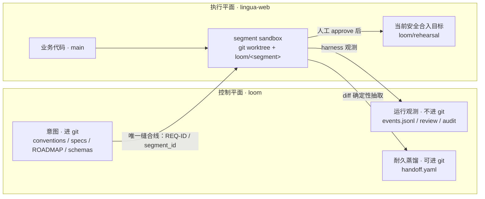

# Loom

Loom 是一个用于软件开发的**半自动化编排与执行框架**：人类把关产品与安全判断——决定“做什么”和“能不能合入”，agent 承担写代码、review、测试与审计等劳作。它不以“全自动 merge”为目标；它的灵魂是一条稳定 ID 串起的可追溯主线：**需求 → segment → 代码 → 测试 → review**，让每个产物和判断都能回到原始需求。

> 当前快照：仓库已实现 P0–P4 的骨架，但还不是生产就绪的自动开发系统。当前合入只到 `loom/rehearsal`，测试不会按 spec 自动生成，review 也尚缺测试充分性检查。先读[已知边界](#已知边界与未完成项)，不要把“骨架存在”理解为“功能已获人类验收”或“可以跳过人工判断”。

## 核心心智模型

理解 Loom 时，先理解它为何刻意不相信“看起来已经完成”。设计依据以 [LOOM-BUILD-BRIEF.md](LOOM-BUILD-BRIEF.md) 为准，代码只是这些约束在当前阶段的一份实现。

### 七条不变量

| 不变量 | 一句话规则 | 为什么 |
|---|---|---|
| A · ID 主线 | 每条需求使用稳定 `REQ-ID`，ROADMAP、segment、代码、测试和 review 都沿用它。 | 没有共同锚点，上下游无法可靠对齐，也无法从结果追溯到需求。 |
| B · 意图与事实分离 | 计划和设计理由进 git；进度、执行结果和“当前有哪些接口”从代码或 harness 事件现读。 | 手写状态会过期并冒充现实，最终让历史文档比真实系统更可信。 |
| C · harness 观测，非 agent 自报 | 改了哪些文件、跑了什么命令、exit code 是多少，只认 harness 记录的证据。 | agent 的自然语言声明不可验证；anti-simulation 要防止“说做过”被当成“真的做过”。 |
| D · 两条独立边界 | sandbox 按 segment 切分文件共享；session 按角色切分上下文共享。 | work/test 需要共享文件才能连续工作，但 test/review/audit 又必须保持认知独立，二者不是同一问题。 |
| E · 确定性硬闸 | 会阻断流程的安全判断必须由确定性代码完成；LLM 只能软告警并升级给人。 | 概率性判断不能成为最终安全权威，也不应拥有不可解释的阻断权。 |
| F · 过程蒸馏后才向前流动 | 下游只消费契约、handoff 等耐久产出，不读取上游原始执行 trace。 | 原始思考与过程噪声会污染下游上下文；真正需要传递的是接口、约束和理由。 |
| G · 人类合入闸不可省略 | review 与 audit 全绿也不自动 merge，最终决定仍由人类作出。 | 自动检查能减少劳动，不能替代产品判断、风险责任与对证据的最终解释。 |

### 双平面拓扑

Loom 跨两个 Git 仓库运行，两者职责不能混用：



- **`loom` 是控制平面**：保存规范、需求和设计理由等意图，也承载 harness 的事件与运行报告；它不放被开发的业务代码。
- **`lingua-web` 是执行平面**：保存业务代码；segment branch、worktree、测试和合入都发生在这里。
- **唯一缝合线是 REQ-ID**：`segment_id` 固定为 `<REQ-ID>/S<n>`，不再维护第二套跨仓库映射。
- `events.jsonl` 和大部分 `runs/` 内容是运行事实，默认被 git 忽略；`handoff.yaml` 是供下游消费的耐久蒸馏产物，按 schema 特例允许纳入 git。

双平面约定的完整定义见 [conventions.md](conventions.md)。

### Review 与 audit 不是同一件事

| | Review | Audit |
|---|---|---|
| 核心问题 | “实现对不对、好不好？” | “这次改动安不安全、能否放行？” |
| 当前输入 | segment 验收标准、相对 `main` 的 branch diff、harness 观测到的改动路径 | 契约 `scope_paths`、同一 run 的 harness 文件观测、branch diff |
| 当前输出 | 每条 AC 的 LLM 意见，以及确定性的文件/scope 展示；意见供人参考 | 确定性的 scope 与高置信 secret 扫描；无观测证据时 fail closed |
| 流程权力 | 可建议“满足 / 存疑 / 不满足”，本身不自动阻断 merge | `blocked` 会让 merge gate 拒绝进入人工决策 |

Brief 对 audit 的目标范围还包括供应链、破坏性操作、隐私、资源与证据完整性；**当前代码只实现了 scope 和 secret 两类硬闸**。同样，当前 review 还没有检查“每条 AC 是否有真实测试覆盖”。人类必须按报告所证明的范围理解报告，不能把目标设计误当成现有能力。

## 架构总览：P0–P4

Loom 的建造与使用都遵守阶段闸：代码存在不代表阶段完成，只有人类亲手使用并认可才算完成。P0–P4 的职责如下。

| 阶段 | 职责 | 关键产物与边界 |
|---|---|---|
| **P0 · 观测底座** | 定义事件、追加写 JSONL、由 harness 包装命令与文件观测，并提供只读视图。 | `events.jsonl`、命令/文件/test 事实、静态 HTML 视图；让 P3 不成为黑盒。 |
| **P1 · Plan 契约与 ID 主线** | 人类写 what/why、how 与按 REQ-ID 编排的 ROADMAP。 | `product.md`、`tech.md`、`ROADMAP.md`、[conventions.md](conventions.md)；ROADMAP 是规划意图，不记录实时进度。 |
| **P2 · Segment 契约与 handoff schema** | 按“可评审性”切出自包含 segment，并规定上下游如何只传递耐久信息。 | `schemas/segment-contract.md`、`schemas/handoff-record.md`、sequence/html preview；执行 agent 无需读取完整大 plan。 |
| **P3 · 单 segment 执行** | LangGraph 编排 `orchestrator → work → test`，每个 segment 使用独立 worktree；test 使用独立上下文，失败走 `implement → test → fix` 循环。 | `loom/<segment>` retained branch、work/test 尝试产物、全程 events；worktree 结束后移除，branch 保留供 P4。 |
| **P4 · Review、audit、人工合入与 handoff** | 先产出 review/audit 证据，再由人类 approve/reject；产物就绪时生成 `pending` handoff，闸结果更新为 `merged` 或 `rejected`。 | `review.md`、`audit.md`、交互式 merge gate、`handoff.yaml`；当前 approve 只合入 `loom/rehearsal`，不进真实 `main`。 |

P5 的多 segment 依赖串联、按 `depends_on` 加载 handoff，以及 P6 的并行与增强能力尚未开始；不要提前假设它们存在。

## 目录结构

```text
loom/
├── src/loom/                 # 框架实现
├── schemas/                  # segment 与 handoff 的耐久契约
├── specs/                    # 按 REQ-ID 归档的产品/技术意图与 segment
├── tests/                    # Loom 自身的单元测试
├── runs/<run_id>/            # 每次 run 的报告与中间产物
├── events.jsonl              # append-only 运行事实，首次运行后出现
├── AGENTS.md                 # agent 常驻纪律
├── LOOM-BUILD-BRIEF.md       # 设计意图、不变量与阶段路线
├── conventions.md            # 人类锁定的 ID 与双平面约定
└── KNOWN-LIMITS.md           # 已知缺口及其历史原因
```

`src/loom/` 中各模块只承担一类职责：

- `events.py`：事件 schema、actor 约束和 append-only JSONL writer。
- `harness.py`：观测命令、exit code、耗时和真实文件变化。
- `sandbox.py`：在执行平面创建/准备 worktree，保留或清理 segment branch。
- `graph.py`：单 segment 的 LangGraph 与 `implement → test → fix` 循环；当前只提供 Python API，没有可工作的 module CLI。
- `review.py`：对 retained branch 生成“硬事实 + LLM 建议”的 review 报告。
- `audit.py`：运行确定性的 scope/secret 硬闸并生成 audit 报告。
- `merge_gate.py`：核对 review/audit 指针，暂停给人类决策，并执行 rehearsal merge 或 reject。
- `handoff.py`：从契约、git diff 和 merge 结果生成/更新 handoff；seams 使用确定性 AST 抽取。
- `view.py`：把事件按 run/segment 过滤并渲染成静态 HTML。

运行产物的 Git 归属很重要：

- `events.jsonl`、`runs/<run_id>/review/`、`audit/`、work/test 原始产物是运行事实，默认不进 git。
- `runs/<run_id>/handoff/handoff.yaml` 是 `.gitignore` 中的明确例外，可作为意图侧的耐久交接记录 review 后提交。

## 快速上手

以下步骤面向当前仓库快照，不假设尚未实现的 CLI 或真 `main` 合入能力。

### 1. 环境与安装

需要：

- Python **3.10+**；
- [uv](https://docs.astral.sh/uv/)；
- Git；
- 已安装并登录的 `codex` CLI：work 与 review 节点会实际调用它；
- 一个可用的 `lingua-web` 执行仓库，其本地 `main` 存在，且项目支持 `uv sync --extra dev`。

在控制平面安装 Loom：

```bash
cd ~/workspace/loom
uv sync
uv run python --version
uv run python -m unittest discover -s tests -v
```

`uv sync` 安装 Loom 自身；每次创建 execution sandbox 时，harness 还会在 fresh worktree 中运行 `uv sync --extra dev`。worktree 不复制 `.venv`，因此这一步不是可选优化。

### 2. 准备双平面

推荐并列放置两个长期仓库：

```text
~/workspace/loom/         # 控制平面
~/workspace/lingua-web/   # 执行平面
```

在 `loom` 根目录设置本次运行变量：

```bash
export LOOM_REPO="$PWD"
export EXEC_REPO="$HOME/workspace/lingua-web"
export CONTRACT="$LOOM_REPO/specs/MAT-REQ-001/segments/S1.yaml"
export SEGMENT_ID="MAT-REQ-001/S1"
export BRANCH="loom/MAT-REQ-001-S1"
export EVENTS="$LOOM_REPO/events.jsonl"
export RUN_ID="mat-req-001-s1-$(date -u +%Y%m%dT%H%M%SZ)-$$"

git -C "$EXEC_REPO" status --short
git -C "$EXEC_REPO" branch --list main "$BRANCH"
```

开始前确认：

- 执行仓库的工作区允许稍后由 merge gate 切换分支；有未提交改动时先停下处理。
- `main` 是本地 branch，不只是 remote ref。
- `$BRANCH` **尚不存在**。branch 名只由 `segment_id` 决定，与 `run_id` 无关；同一 segment 的 retained branch 会阻止重跑。
- `$RUN_ID` 在同一个 `events.jsonl` 中从未使用过，并在 graph、review、audit、gate 全程保持一致。

> 当前真实 `lingua-web` 已保留被 reject 的 `loom/MAT-REQ-001-S1`，因此不要在现有现场直接复制命令重跑 S1，也不要为跑示例静默删除它。下面是 S1 在**同名 branch 尚不存在的真实执行平面**上的完整序列；旧 branch 如何处置必须由人类决定。

### 3. 执行 graph

当前有一个必须正视的入口缺口：`src/loom/graph.py` 没有 `main()`/`argparse`，所以 `uv run python -m loom.graph --help` 会静默退出 0，却不会显示帮助或执行 segment。补齐 CLI 应作为独立实现任务走 TDD；README-only 范围内，真正可运行的入口是 `run_segment_graph()`：

```bash
uv run python - <<'PY'
import json
import os

from loom.graph import run_segment_graph

state = run_segment_graph(
    contract_path=os.environ["CONTRACT"],
    run_id=os.environ["RUN_ID"],
    events_path=os.environ["EVENTS"],
    execution_repo_path=os.environ["EXEC_REPO"],
)
summary = {
    "segment_id": state.get("segment_id"),
    "status": state.get("status"),
    "attempts": state.get("attempts"),
    "branch": state.get("sandbox", {}).get("branch_name"),
}
print(json.dumps(summary, ensure_ascii=False, indent=2))
if state.get("status") != "passed":
    raise SystemExit("segment did not pass; stop before review")
PY
```

graph 会：

1. 从契约读取 segment、AC、scope、anti-scope、test selectors 与 sequence diagram；
2. 在 `~/.loom/worktrees/MAT-REQ-001-S1` 创建 worktree 和 `loom/MAT-REQ-001-S1` branch；
3. 准备依赖，运行 work session，再按契约运行现成 pytest 文件；失败时最多进入 fix 循环；
4. 由 harness 把命令、exit code、文件变化与测试结果追加到 `$EVENTS`；
5. 移除 worktree，但提交并保留 branch 供 P4 使用——正常结束为 `status=failed` 时也会保留，失败时不要继续 review；若 graph 因异常未得到最终状态，则会清理 worktree 和 branch。

### 4. Review

```bash
uv run python -m loom.review \
  --contract "$CONTRACT" \
  --run-id "$RUN_ID" \
  --branch "$BRANCH" \
  --events "$EVENTS" \
  --repo "$EXEC_REPO"
```

命令打印报告路径，通常是 `runs/$RUN_ID/review/review.md`。阅读两部分：

- “硬事实”是否列出了正确的 harness-observed changed files 与 scope 结果；
- 每条 AC 的 LLM 意见和理由是否真的由 diff 支撑。

不要从“AC 满足”推断“测试充分”；当前 review 尚未建立这条证据链。

### 5. Audit

```bash
uv run python -m loom.audit \
  --contract "$CONTRACT" \
  --run-id "$RUN_ID" \
  --branch "$BRANCH" \
  --events "$EVENTS" \
  --repo "$EXEC_REPO"
```

报告通常位于 `runs/$RUN_ID/audit/audit.md`。当前要检查：

- scope gate 是否有同一 run 的文件观测，是否出现越界路径；
- secret gate 是否命中新增行中的高置信 credential；
- overall verdict 是否为 `passed`。无 `files_changed` 观测会被视为 `blocked`，不是空集合通过。

### 6. 人类合入闸

先读报告，再启动交互式 gate：

```bash
sed -n '1,240p' "runs/$RUN_ID/review/review.md"
sed -n '1,240p' "runs/$RUN_ID/audit/audit.md"

uv run python -m loom.merge_gate \
  --contract "$CONTRACT" \
  --run-id "$RUN_ID" \
  --branch "$BRANCH" \
  --events "$EVENTS" \
  --repo "$EXEC_REPO"
```

gate 的真实行为：

- review pointer 缺失，或 audit 缺失/无效/`blocked` 时，状态为 `refused`，不会询问人工决策；**当前 CLI 即使 refused 也返回 exit 0**，必须看打印的 `merge gate status` 和 events，不能只看 shell exit code。
- 证据齐全时，先生成 `pending` handoff，再提示输入 `approve` 或 `reject`。
- `approve`：将 source branch `--no-ff` 合入执行平面的 **`loom/rehearsal`**，写入真实 merge commit，更新 handoff 为 `merged`，再删除 source branch；不会触碰真 `main`。
- `reject`：要求非空的人类理由，保留 source branch，把 handoff 更新为 `rejected`；rejected handoff 不含 seams。

最后检查：

```bash
sed -n '1,240p' "runs/$RUN_ID/handoff/handoff.yaml"
git status --short -- "runs/$RUN_ID/handoff/handoff.yaml"
git -C "$EXEC_REPO" branch --list "$BRANCH" loom/rehearsal
```

正常链路不需要单独运行 `handoff`：merge gate 已负责生成和更新。下面的 CLI 只用于根据 retained branch 或既有 reject event **回填/重建**记录；提前运行会重复生成记录和事件：

```bash
uv run python -m loom.handoff \
  --contract "$CONTRACT" \
  --run-id "$RUN_ID" \
  --branch "$BRANCH" \
  --events "$EVENTS" \
  --repo "$EXEC_REPO"
```

### 7. 用 P0d 视图查看 run

`view` 只读 `events.jsonl` 并生成静态 HTML，不改变事件：

```bash
uv run python -m loom.view \
  --events "$EVENTS" \
  --run-id "$RUN_ID" \
  --segment-id "$SEGMENT_ID" \
  --output "events-$RUN_ID-view.html"
```

然后用浏览器打开 `events-$RUN_ID-view.html`。view 不会自动打开浏览器，也不会打印 output 路径。出现判断争议时，回到对应 `command_run`、`files_changed`、review/audit/handoff pointer，而不是引用 agent 的文字总结。

一次 run 的主要产物如下：

| 位置 | 含义 | Git 归属 |
|---|---|---|
| `events.jsonl` | 由 Loom/harness 写入、按 actor 标注的 append-only 事件，是运行事实主线 | 忽略 |
| `runs/<run_id>/<segment>/work-attempt-*` | work prompt、结构化输出及命令证据 | 忽略 |
| `runs/<run_id>/<segment>/test-attempt-*` | pytest stdout/stderr 与尝试证据 | 忽略 |
| `runs/<run_id>/review/review.md` | 硬事实展示 + LLM review 建议 | 忽略 |
| `runs/<run_id>/audit/audit.md` | 当前 scope/secret 硬闸报告 | 忽略 |
| `runs/<run_id>/handoff/handoff.yaml` | 下游可消费的耐久交接记录 | 可纳入 git |

## 关键工作流约定

### Segment 契约怎么写

以 [segment contract schema](schemas/segment-contract.md) 为准。契约必须自包含，让执行 agent 不必读取全局 plan 才能工作：

- `segment_id`：`<REQ-ID>/S<n>`，例如 `MAT-REQ-001/S1`；是 ID 主线锚点。
- `covers_req`：单个 REQ-ID；一个 segment 只服务一个需求。
- `title`：一句话的人类可读名称。
- `acceptance`：每条使用 `<segment_id>/AC<n>`，必须能翻译为明确 pass/fail 的测试；它同时是 test 派生源和 review 靶子。
- `anti_scope`：`defer` 表示后续 segment 会做，语义上命中是抢跑警告并流入 handoff；`out_of_req` 表示整个需求都不做，设计上命中应阻断。当前 review/audit 尚未实现内容级 anti-scope 判定，不能把这条设计规则误读成已有自动检查。
- `depends_on`：上游 segment 列表；既决定执行顺序，也决定未来 P5 只加载哪些 handoff。
- `scope_paths`：允许修改的执行平面路径，是确定性越界闸的锚；写契约前必须核对真实 repo 结构。
- `test_selectors`：由人指定的**现成 pytest 文件**，必填但可为 `[]`；测试文件必须在 `scope_paths` 外，防止 work agent 改测试迎合实现。当前 test 节点不会生成新测试。
- `preview`：所有 segment 都要有 sequence diagram；有用户可见 UI 时还要有 HTML preview。它既是预览，也应成为 P4 的漂移检测靶子。

试点 [MAT-REQ-001/S1](specs/MAT-REQ-001/segments/S1.yaml) 的上游意图分别在 [product.md](specs/MAT-REQ-001/product.md)、[tech.md](specs/MAT-REQ-001/tech.md) 与 [ROADMAP.md](specs/MAT-REQ-001/ROADMAP.md)。该需求解决的是“错误来源标签永久污染素材及 `/knowledge` 过滤结果”；人类已锁定只删关联、不删标签，使用硬删除、整页刷新和二次确认，不做批量或撤销。

### Handoff 怎么读

[handoff schema](schemas/handoff-record.md) 按“写错的代价”划分可信度：

| 可信度 | 字段 | 来源与读法 |
|---|---|---|
| 硬事实 | `seams`、`covers_req`、`pointers` | harness 从契约、git/diff 和运行产物确定性取得；不能由 LLM 自由填写。 |
| 机械搬运 | `covers_req`、`deferred` 中的 `origin: contract` | 原样来自上游契约，不包含新的判断。 |
| 软信息 | `key_decisions`、`deferred` 中的 `origin: discovered` | LLM 蒸馏、供人参考；允许为空，不能当硬闸依据。当前实现尚未生成这两类软信息。 |

`seams` 是下游真正要对接的公共接口，不是 agent 的“实现说明”。当前抽取器只支持 Python/FastAPI/SQLAlchemy，并采取**宁漏勿误报**的保守口径：

- 路由：新增或变更的 FastAPI method + router prefix/path；
- 函数：新增或签名变化的模块顶层、非 `_` 私有函数；
- DB：SQLAlchemy 表/字段的结构变化；
- 函数体内未形成顶层接口的逻辑不计入 seams，**绝不从业务 DML 猜 DB seam**。

生命周期：

- `pending`：产物就绪，已从 branch 相对 `main` 的 diff 抽取主体，但尚未进入人工决策；`pointers.merge_commit` 为空。
- `merged`：人类 approve 后更新，必须带实际 merge commit。
- `rejected`：保留 `covers_req`、人类 `reject_reason` 和 `deferred`；不抽取/不保留 seams，也不让下游依赖未合入接口。

### 不可破坏的运行约定

- 同一 `events.jsonl` 中 `run_id` 全局一次性使用；重复启动 graph 会被确定性拒绝。
- graph、review、audit、merge gate 与 handoff 必须沿用同一个 `run_id` 和 `segment_id`，否则证据无法拼接。
- segment branch 名只由 `segment_id` 生成；新 `run_id` 不会绕过旧 retained branch。
- agent 不得手写、改写或补造运行事件；事件必须来自 harness/orchestration 的观测路径。
- 计划、设计理由、schema 和耐久 handoff 属于 git 意图侧；事件、进度、命令输出和运行报告属于观测侧，默认不进 git。
- 事实判断必须在正确平面完成：业务 diff、branch、测试都去 `lingua-web`；事件、契约、报告和 handoff 都在 `loom`。
- LangGraph checkpoint 只服务图恢复/interrupt，不是进度真相源；进度必须由事件查询派生。

## 给未来 agent

### 安全接手顺序

1. 先完整阅读 [AGENTS.md](AGENTS.md) 和 [LOOM-BUILD-BRIEF.md](LOOM-BUILD-BRIEF.md)；七条不变量不是可局部优化掉的实现细节。
2. 再读 [conventions.md](conventions.md)、两个 [schemas](schemas/) 和 [KNOWN-LIMITS.md](KNOWN-LIMITS.md)，分清人类已定的接口与当前未实现能力。
3. 针对任务读取对应 `specs/<REQ-ID>/product.md`、`tech.md`、`ROADMAP.md` 和 segment YAML；不要只从代码倒推“为什么”。
4. 最后才读相关 `src/loom/` 与 tests，用代码核对“当前做到了什么”，不要让当前实现反过来改写设计意图。

继续开发时：一次只做一个已获授权的任务；阶段未获人类验收就不推进下一阶段；不自行修改 REQ-ID 规则、segment/handoff 字段或七条不变量。代码变更必须从 spec 派生测试，先确认红、留下 checkpoint，再实现到绿；不能改测试迎合实现。任何“已通过/已完成”都要附真实命令、exit code 和 diff，agent 自报不构成证据。删除、migration、schema、凭证、网络出口和新依赖属于高代价操作，先停下交给人类决定。

### 已知边界与未完成项

完整历史和理由见 [KNOWN-LIMITS.md](KNOWN-LIMITS.md)。接手时至少牢记：

- **graph module CLI 缺失**：当前 `python -m loom.graph` 是静默 no-op；只能通过 Python API 运行。补 CLI 是独立任务，不能靠 README 假装存在。
- **测试链不完整**：test 只运行契约指定的现成测试，不从 acceptance 生成新测试；`succeeded/passed` 也不等于功能正确。
- **review 证据不足**：没有逐 AC 的测试充分性检查，且尚未用已知坏实现验证其识别能力；LLM opinion 不应自动阻断或放行。
- **audit 只是当前子集**：现实现确定性的 scope 与 secret 闸；Brief 中其他安全项仍是目标，不是已交付事实。
- **合入仍是演习**：approve 只到 `loom/rehearsal`，不会进入 `lingua-web/main`；何时切真 main 由人类在建立报告信任后决定。
- **as-built 仍未闭环**：schema 有 `pointers.as_built_diagram`，但当前流程尚未生成反向图，handoff 中该指针为空。
- **seams 绑定当前栈**：只懂 Python/FastAPI/SQLAlchemy；换栈必须重写抽取规则，不能用 LLM 模糊补齐。
- **事件存储尚未并发化**：writer 没有文件锁，所有 run 共用一个 JSONL；多 run 查证必须同时按 `run_id + segment_id` 过滤，P5 并行前要解决串行化/切分。
- **失败分类较粗**：当前记录 exit code 与耗时，但不能可靠区分超时、命令配置错误和实现错误，fix 循环可能盲重试。
- **执行环境有真实前提**：scope path 必须匹配真实 execution repo；fresh worktree 依赖 `uv sync --extra dev`；真实产物必须在真实执行平面验证，临时 repo 不能证明持久 branch/merge。
- **P5/P6 未实现**：不要假设多 segment 依赖装载、并行执行或回归累积已经存在。

### 当前历史状态：MAT-REQ-001/S1 被 reject

P0–P4 骨架已实现到 handoff 生命周期，但第一次真实 S1 合入判断证明了“绿灯不等于可信”：review 曾把四条 AC 都评为满足，audit 也 `passed`，59 个测试却全部是原有 add/tagging 测试，没有覆盖新增 remove 功能；work 的自我报告同样不可靠。人类因此 reject，理由为“移除功能没有测试覆盖；工作自我报告不可靠”。

这段历史被耐久记录在 [KNOWN-LIMITS.md](KNOWN-LIMITS.md) 和 [rejected handoff](runs/p4-0-real-verify-001/handoff/handoff.yaml) 中。后者没有 seams，只保留 `covers_req`、人类拒绝理由和契约延期项，正是 handoff schema 对 rejected 产物的要求。这个案例不是系统失败记录的污点，而是 Loom 保留人工合入闸和 anti-simulation 的直接理由。

---

设计问题以 [LOOM-BUILD-BRIEF.md](LOOM-BUILD-BRIEF.md) 为根；操作纪律以 [AGENTS.md](AGENTS.md) 为准；当前实现边界以 [KNOWN-LIMITS.md](KNOWN-LIMITS.md) 与真实 harness 事件为准。遇到三者未覆盖的选择，提出一个具体方案并一次只向人类问一个问题，不自行补定义。
